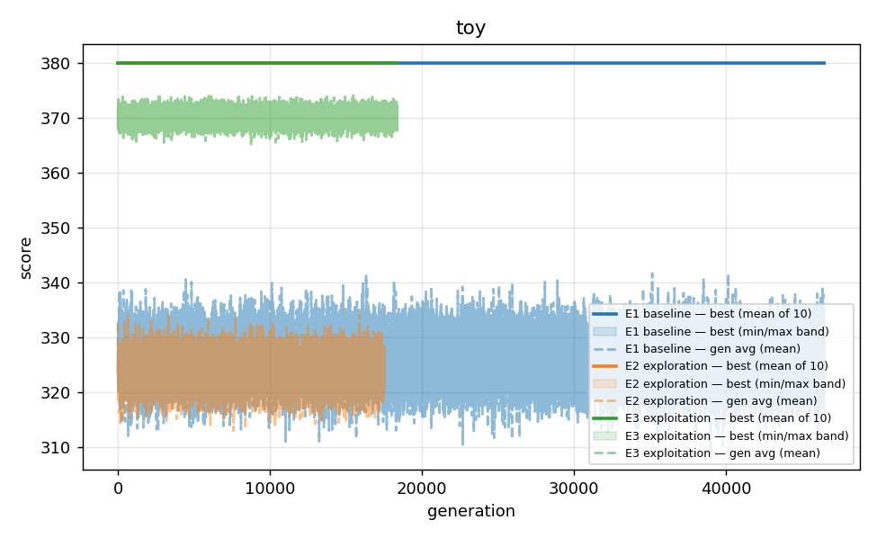
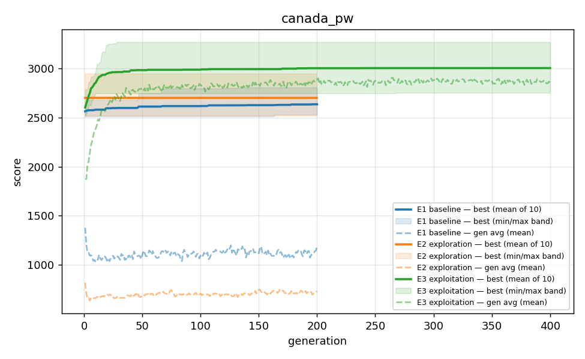
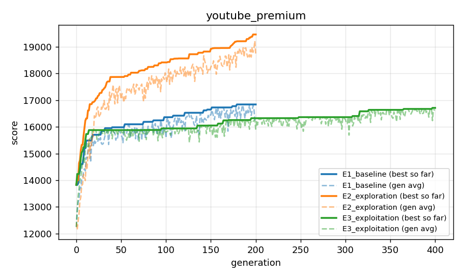

<table border="0">
 <tr>
    <td></td>
    <td>
      <p><strong>University of Prishtina</strong></p>
      <p>Faculty of Electrical and Computer Engineering</p>
      <p>Computer and Software Engineering — Master's Program</p>
      <p>Professor: Prof. Kadri Sylejmani</p>
      <p>Assistant: Prof. Labeat Arbneshi</p>
      <p>Course: Algoritmet e Inspiruara nga Natyra</p>
    </td>
 </tr>
</table>
# TV Channel Scheduling Optimization — Phase 1 + Phase 2

## 1. Introduction

This project addresses the **TV Channel Scheduling Optimization for Public Spaces** problem from the Advanced Algorithms course (2025/26). Given a set of TV channels, each with a list of timed programs annotated with genre and viewer-score, the task is to select and schedule a non-overlapping subset of programs across the available broadcast window in order to **maximize total viewership score**, subject to constraints: programs must lie inside the global time window, must satisfy a minimum on-air duration, must respect a maximum consecutive same-genre run length, and must honor priority blocks that restrict which channels can broadcast at certain times. Time preferences add bonus points when a chosen program's genre matches the genre preferred for that time slot, and penalties are applied for switching channels mid-stream and for terminating the previous program early.

This repository contains:
- **Phase 1** — the original constructive heuristic (the greedy scheduler) and a comparison against another team's heuristic (Endrita's beam search).
- **Phase 2** — a Genetic Algorithm built on top of the same parser, fitness components, and validator, run across 17 instances × 3 configurations × 10 runs (510 executions) and benchmarked against Phase 1.

---

## 2. Phase 1 — Baseline solutions

### 2.1 Solution picked: the **Greedy Scheduler**

the base repository contains several Phase 1 attempts spread across branches (`greedy_lookahead`, several beam search variants, an `UpperBoundGreedy`, and even a C# `SchedulingAPI`), but **only `scheduler/greedy_scheduler.py` is present on `main`**. We picked **Greedy** as the Phase 1 baseline because:
- It is the only complete Python scheduler merged into the `main` branch, so it is the cleanest single starting point.
- It is a classical constructive heuristic — the standard fair baseline for a Genetic Algorithm comparison.
- Endrita's repository already provides the stronger Beam Search heuristic, so Phase 1 has a meaningful "team-vs-team" axis without needing to combine multiple solutions from the base repo.

### 2.2 Greedy logic — algorithm + fitness function

The greedy scheduler walks time forward from `opening_time` to `closing_time`. At every minute it asks `AlgorithmUtils.get_best_fit` which channel/program would yield the highest **per-step fitness** at the current time, given the schedule built so far:

```
fit(c, p, t, S) =   p.score
                  + Σ tp.bonus       for every TimePreference tp where
                                     tp.preferred_genre == p.genre
                                     AND  [tp.start, tp.end)  overlaps  [p.start, p.end)
                  − switch_penalty       if S non-empty AND S[-1].channel_id != c.channel_id
                  − termination_penalty  if S non-empty AND S[-1].unique_program_id != p.unique_id
                                         AND p.start < S[-1].end
                  + 0                    (delay_penalty disabled in the codebase)
```

A program is accepted only if it satisfies the validator (time-window, min-duration gap, max-consecutive-genre, priority blocks), does not overlap the previous broadcast, and has `fit > 0`. The total score returned by the scheduler is the sum of all accepted per-step fitnesses. **The Phase 2 GA uses exactly this fitness function** (`AlgorithmUtils.*`) so the two are directly comparable.

### 2.3 Phase 1 comparison — Greedy vs Endrita (Beam Search)

Endrita's beam search uses `beam_width = 100`, `lookahead = 4`, `density_percentile = 25` (auto-bumped to `beam_width = 500` for instances with > 50 channels). To produce his column we ran his code (via `endrita_repo/run_batch.py`) with a **10-minute per-instance hard cap** because the auto-bumped beam width hangs on the largest instances. The pre-published scores Endrita ships in his repo (germany 1553, uk_tv 2266, usa 3601) match our re-run exactly, confirming the algorithm was reproduced correctly.

| instance | Greedy | Endrita (beam) | best |
|---|---:|---:|:---:|
| australia_iptv | 1346 | 4117 | Endrita |
| canada_pw | 1070 | 4628 | Endrita |
| china_pw | 1296 | (timeout) | Greedy |
| croatia_tv_input | 1278 | 2203 | Endrita |
| france_iptv | 1215 | 4370 | Endrita |
| germany_tv_input | 725 | 1553 | Endrita |
| kosovo_tv_input | 1160 | 2587 | Endrita |
| netherlands_tv_input | 1133 | 2636 | Endrita |
| singapore_pw | 1223 | 4316 | Endrita |
| spain_iptv | 978 | 4555 | Endrita |
| toy | 380 | 380 | tie |
| uk_iptv | 1491 | (timeout) | Greedy |
| uk_tv_input | 1098 | 2266 | Endrita |
| us_iptv | 1513 | (timeout) | Greedy |
| usa_tv_input | 1711 | 3601 | Endrita |
| youtube_gold | 13058 | (timeout) | Greedy |
| youtube_premium | 19900 | (timeout) | Greedy |

**Phase 1 summary:** Endrita wins 11, Greedy wins 5 (all five are instances where Endrita's beam search exceeded the 10-min budget), 1 tie (`toy` at the optimum 380). Endrita's beam search dominates wherever it can finish; the greedy is the only baseline available on the very largest inputs.

---

## 3. Phase 2 — Genetic Algorithm

### 3.1 Project layout

```
greedy_repo/
├── parser/, models/, utils/, validator/, serializer/   
├── scheduler/greedy_scheduler.py                       
├── ga/
│   ├── chromosome.py        
│   ├── operators.py        
│   ├── ga_solver.py         
│   └── config.py           
├── data/
│   ├── input/               
│   └── output/              
│                            
├── run_phase1_comparison.py 
├── run_phase2_ga.py         
├── build_results_tables.py  
├── plot_convergence.py      
└── results/
    ├── results_phase1_greedy.csv           
    ├── results_phase1_endrita.csv          
    ├── results_phase1_comparison.csv / .md
<<<<<<< HEAD
    ├── results_phase2_ga.csv               # 510 rows (1 per (instance, experiment, run))
    ├── table_ga_per_experiment.csv / .md   # 17×3 stats (best / avg / worst / std)
    ├── table_final_comparison.csv / .md    # Greedy | Endrita | GA-best | Δ%
    ├── history/                            # 510 per-run convergence logs (gen, best_score, avg_score)
    ├── convergence/                        # 51 per-(inst,exp) run-0 gen logs (extra elapsed_s column)
    └── plots/                              # 17 per-instance PNGs + 1 representative
=======
    ├── results_phase2_ga.csv               
    ├── table_ga_per_experiment.csv / .md   
    ├── table_final_comparison.csv / .md    
    ├── convergence/                        
    └── plots/                              
>>>>>>> c3c1baa2ac7ef7760899a4364df939541a4e4a78

endrita_repo/                                
├── data/
│   ├── input/               
│   └── output/              
│                            
└── run_batch.py             
```

### 3.2 Chromosome encoding — variable-length list of scheduled programs

Per the assignment spec:
- **Chromosome = one complete schedule** (a list of accepted programs in time order).
- **Gene = one scheduled program/item** (a `Schedule` object: `program_id`, `channel_id`, `start`, `end`, `fitness`, `unique_program_id`).
- **Fitness = total score of the schedule.**

So the chromosome type is `List[Schedule]` ordered by `start` time. Different chromosomes may have different lengths (a chromosome that fills the day with many short programs is longer than one with a few long ones). Every chromosome that the GA evaluates is **valid by construction** (built by greedy/randomized-greedy initialization or sanitized by `repair()` after crossover/mutation), so the chromosome's `total_score` is directly comparable to greedy's score on the same instance.

Concrete example for `toy.json` (opening 540, closing 1080, min_duration 30):

```
chromosome = [
    Schedule(program_id="n1", channel_id=0, start=540,  end=600, fitness=130, uid=1),
    Schedule(program_id="n2", channel_id=0, start=600,  end=660, fitness= 70, uid=2),
    Schedule(program_id="s2", channel_id=1, start=840,  end=960, fitness=125, uid=4),
    Schedule(program_id="m1", channel_id=2, start=960,  end=1020, fitness=55, uid=5),
]
total_score = 130 + 70 + 125 + 55 = 380
```

**Why variable-length:** the assignment defines a chromosome as "one complete schedule". A schedule has as many items as fit in the broadcast window, so a fixed-length encoding would have to either pad or truncate — both lose information. The problem-specific crossover operators below are designed to preserve schedule semantics rather than treat the chromosome as an aligned bit-string.

### 3.3 Fitness function — same as Phase 1

The GA reuses **the same per-step fitness components** that the greedy scheduler uses, summed over the chromosome's accepted decisions, so a Phase 2 score is directly comparable to a Phase 1 score on the same instance:

```
fitness(chromosome) =
    Σ  ( p.score
       + AlgorithmUtils.get_time_preference_bonus(instance, p, p.start)
       + AlgorithmUtils.get_switch_penalty(prev, instance, channel)
       + AlgorithmUtils.get_delay_penalty(prev, instance, p, p.start)        # 0
       + AlgorithmUtils.get_early_termination_penalty(prev, instance, p, p.start)
       )
    over every gene that decoded into a valid Schedule with step-fitness > 0
```

### 3.4 Operators — and why shift/replace/swap/insert were excluded

| | |
|---|---|
| **Selection** | Tournament (size `k` configurable) |
| **Crossover** | **Time-window crossover** OR **channel-based crossover** (one chosen per experiment) |
| **Mutation** | **Remove a random program** OR **greedy repair/regeneration** (one picked uniformly at random per call) |
| **Elitism** | Top-N copied unchanged into the next generation |

**Time-window crossover** ([`ga/operators.py:time_window_crossover`](ga/operators.py)) — picks a split time `t ∈ (opening, closing)`. Child 1 = parent 1's items ending at or before `t` + parent 2's items starting at or after `t`. Child 2 is the symmetric combination. The encoder's `repair()` cleans any seam violations.

**Channel-based crossover** ([`ga/operators.py:channel_based_crossover`](ga/operators.py)) — picks a random subset `S` of channels. Child 1 = parent 1's items on channels in `S` + parent 2's items on channels not in `S`. Child 2 is the complement.

**Remove-program mutation** ([`ga/operators.py:remove_random_program_mutation`](ga/operators.py)) — drops one randomly-chosen scheduled program from the chromosome. The empty slot is implicitly re-filled the next time crossover or repair touches that range.

**Greedy repair/regeneration mutation** ([`ga/operators.py:greedy_repair_regeneration_mutation`](ga/operators.py)) — picks a random cut point `k`, keeps `chromosome[0:k]` verbatim, and re-generates the tail with the deterministic greedy from `chromosome[k-1].end` (or `opening_time` if `k==0`). This recovers structure after disruption and explicitly does **not** "shift" a single program; it rebuilds the tail from a constructive baseline.

**Reasoning:** these operators are problem-specific and respect the schedule semantics. They drive the search through **recombination of schedule substructures** (a morning vs. afternoon plan, or a per-channel plan), which is what makes a GA a GA, not a hill-climber.

The professor explicitly **excluded** `shift / replace / swap / insert`. We did not use them:
- **shift** would re-position a single program by ±dt — none of our operators move a program; we either drop it (`remove`) or re-build the tail (`regenerate`).
- **swap** would exchange two existing genes' positions — never done; crossover combines sub-lists from two parents instead.
- **replace** would substitute one program for another at the same slot — never done; mutation either deletes or re-greedies.
- **insert** would add a program at a chosen position — only the greedy regeneration adds programs, and it does so by re-running the constructive heuristic, not by inserting at a chosen index.

These are all *positional, single-individual edits* — Phase-1 / local-search style. Avoiding them keeps the GA distinguishable from a hill-climber and makes the Phase 1 → Phase 2 comparison honest.

### 3.5 Repair strategy — repair-by-decoding (no penalty fitness)

After time-window crossover or channel-based crossover, a chromosome may contain overlapping items (e.g. parent 1's morning ended at 10:00 but parent 2's afternoon starts at 9:30 on a different channel). After remove-program mutation, a chromosome may have a gap (which is fine — the schedule just has unused time). We **repair on decode** rather than penalizing invalid solutions.

`ChromosomeEncoder.repair()` walks the chromosome's items in time order. For each item it:

1. Looks up the program by `unique_program_id` (drop if unknown).
2. Verifies the program fits inside the window (`program.end ≤ closing_time`, `program.end − program.start ≥ min_duration`).
3. Enforces no overlap with the previous accepted item and no same `unique_program_id` back-to-back.
4. Runs the existing `Validator` (time-window, min-duration gap, max_consecutive_genre, priority blocks).
5. Computes per-step fitness with the same components the greedy uses.
6. Rejects the item if step-fitness ≤ 0 (matching greedy's gating exactly).

Surviving items form the decoded `Solution`; rejected items contribute 0. **No penalty fitness is needed**, because every reported `total_score` corresponds to a fully valid solution by construction.

**Why repair, not penalty:** penalty-based fitness floods the early population with negative scores and slows convergence (the GA spends generations climbing out of the penalty pit instead of exploring). Repair-by-decoding keeps the search productive while still enforcing every constraint exactly.

### 3.6 Initial population (greedy-seeded + randomized greedy)

The initial population is built as follows:
- **One greedy-seeded individual** — the canonical Phase 1 greedy solution (`GAConfig.seed_with_greedy = True`).
- **`population_size − 1` randomized-greedy individuals** — same constructive logic as greedy, but at each step pick uniformly at random among the **top-K positive-fitness candidates** (K = 3 by default) instead of always the best. This produces diverse-but-valid starting chromosomes.

Combined with elitism, the greedy seed **guarantees the GA's reported best is never worse than the greedy baseline**. Greedy seeding is an *initialization* technique, not a banned evolution operator — it does not appear in the offspring pipeline at all, and it is standard practice in the GA literature for problems with strong constructive heuristics.

### 3.7 GA parameters — definitions

These are the seven parameters that the experiments vary. They are defined in [`ga/ga_solver.py`](ga/ga_solver.py) (`GAConfig`) and assigned per-experiment in [`ga/config.py`](ga/config.py).

| Parameter | What it controls |
|---|---|
| `population_size` | How many chromosomes live in each generation. Larger → more genetic diversity per generation, more compute per generation. |
| `generations` | Maximum number of generations the loop runs (early-exit if `time_limit_seconds` hits first). |
| `crossover_rate` | Probability that a selected pair of parents is recombined to produce offspring (`1 − crossover_rate` clones the parents instead). |
| `mutation_rate` | Probability that each newly-created child has one mutation applied to it. |
| `tournament_size` | How many individuals compete in each tournament-selection round. Larger → stronger selection pressure (better individuals propagate faster, but at the cost of diversity). |
| `elitism` | Top-N individuals copied unchanged into the next generation. Guarantees the GA's best score never regresses. |
| `crossover_type` | Which problem-specific crossover operator is used: `time_window` / `channel`. |
| `time_limit_seconds` | Hard wall-time cap per run; checked at the top of each generation. Default 300 s (= 5 min). |

### 3.8 Three experiments

| Param | E1 — Baseline | E2 — Exploration | E3 — Exploitation |
|---|---:|---:|---:|
| `population_size` | 50 | 100 | 100 |
| `generations` | 200 | 200 | 400 |
| `crossover_rate` | 0.8 | 0.8 | 0.9 |
| `mutation_rate` | 0.10 | 0.15 | 0.15 |
| `tournament_size` | 3 | 3 | 3 |
| `elitism` | 2 | 3 | 3 |
| `crossover_type` | time_window | time_window | channel |
| `time_limit_seconds` | 300 (5 min) | 300 (5 min) | 300 (5 min) |

These three configurations are applied **as-is to all 17 instances** (parameters are *fixed within an experiment*, *changed between experiments*) so the score effect of changing parameters is isolated from instance-specific noise.

**What each configuration is testing:**

- **E1 (Baseline)** — small population (50), moderate mutation, time-window crossover, small elite. Reference point for the other two.
- **E2 (Exploration)** — doubles the population to 100 and bumps mutation + elitism. Tests whether more diversity per generation, with the same generation budget, lifts scores.
- **E3 (Exploitation)** — keeps E2's larger population, doubles the generation budget to 400, raises crossover rate to 0.9 and switches to **channel-based crossover**. Tests whether (a) more generations within the 5-min cap and (b) a different recombination axis (per-channel rather than per-time-window) lifts scores further.

### 3.9 Reproducibility & execution

- Per-run seed: `seed = run_index` (0..9), passed to a per-run `random.Random`.
- Hard cap: 5 minutes wall time per run, checked at the top of each generation.
- Parallelism: `multiprocessing.Pool(os.cpu_count() − 1)`.
- Progress: `tqdm` over the 510 tasks.
- Outputs in `results/`:
  - `results_phase2_ga.csv` — one row per (instance, experiment, run) with the final best score
  - `history/` — **510 per-run convergence logs** (`generation, best_score, avg_score`), one CSV per (instance, experiment, run); the canonical record used to rebuild every table and plot below
  - `convergence/` — same idea but only run-0 per (instance, experiment), with extra `elapsed_s` column for wall-time tracking
  - `plots/` — per-instance convergence PNGs (mean over 10 runs + min/max band) plus a small/medium/large representative figure

**Wall-time of the 510-run sweep** (estimated from convergence `elapsed_s`, scaled per (inst,exp)):

| Experiment | Runs | Avg / run | Min | Max | Sum (CPU-time) |
|---|---:|---:|---:|---:|---:|
| E1_baseline | 170 | 124.6 s (~2 min) | 1.0 s | 300 s | ~353 min |
| E2_exploration | 170 | 121.8 s (~2 min) | 4.3 s | 300 s | ~345 min |
| E3_exploitation | 170 | 137.4 s (~2.3 min) | 4.5 s | 300 s | ~389 min |
| **Total** | **510** | — | — | — | **~1087 min ≈ 18.1 h CPU-time** |

With 15 parallel workers (`multiprocessing.Pool`) the practical wall-time is **~72 minutes**. The 300-second cap is hit on the largest instances (`australia_iptv`, `china_pw`, `us_iptv`, `youtube_gold` in E1), meaning those runs did not finish all 200/400 generations within the 5-minute budget. Small instances (`toy`, `germany`, `kosovo`, `netherlands`) finish in under 20 seconds.

---

## 4. Results

### 4.1 Per-experiment table (best / avg / worst / std over 10 runs)

Built by [`build_results_tables.py`](build_results_tables.py) from the 510 history files. The `t(s)` column is the wall-time per run (estimated from the `convergence/` per-(inst,exp) elapsed_s, scaled by the gen-count ratio between convergence and history; capped at the 300 s per-run limit).

| instance | E1 best | E1 avg | E1 worst | E1 std | E1 t(s) | E2 best | E2 avg | E2 worst | E2 std | E2 t(s) | E3 best | E3 avg | E3 worst | E3 std | E3 t(s) |
|---|---:|---:|---:|---:|---:|---:|---:|---:|---:|---:|---:|---:|---:|---:|---:|
| australia_iptv | 2875 | 2658.2 | 2509 | 101.4 | 300.0 | 2875 | 2619.3 | 2464 | 109.6 | 300.0 | **3103** | 2846.7 | 2641 | 160.5 | 300.0 |
| canada_pw | 2804 | 2633.5 | 2528 | 78.1 | 212.0 | 2944 | 2697.0 | 2514 | 128.8 | 300.0 | **3266** | 3001.7 | 2750 | 175.3 | 300.0 |
| china_pw | 1926 | 1840.2 | 1725 | 57.4 | 300.0 | 1983 | 1835.4 | 1741 | 63.6 | 300.0 | **2086** | 1932.3 | 1725 | 110.5 | 300.0 |
| croatia_tv_input | **1733** | 1580.2 | 1401 | 98.2 | 2.8 | 1647 | 1482.1 | 1371 | 82.5 | 10.2 | 1704 | 1623.6 | 1541 | 54.3 | 13.2 |
| france_iptv | **2335** | 2130.9 | 1966 | 122.0 | 67.7 | 2255 | 2088.1 | 1980 | 76.1 | 42.9 | 2304 | 2187.9 | 2052 | 74.4 | 157.9 |
| germany_tv_input | 932 | 917.9 | 907 | 7.2 | 1.0 | **937** | 915.2 | 877 | 16.7 | 9.9 | 932 | 910.5 | 882 | 14.7 | 11.6 |
| kosovo_tv_input | 1402 | 1335.7 | 1233 | 53.9 | 9.4 | 1358 | 1308.2 | 1223 | 49.8 | 9.1 | **1518** | 1437.8 | 1297 | 61.5 | 20.0 |
| netherlands_tv_input | 1506 | 1355.5 | 1239 | 80.8 | 2.0 | 1410 | 1333.5 | 1246 | 51.5 | 4.3 | **1539** | 1424.9 | 1283 | 80.1 | 18.2 |
| singapore_pw | 2541 | 2338.1 | 2153 | 110.8 | 34.6 | 2426 | 2313.8 | 2139 | 95.4 | 115.3 | **2792** | 2622.6 | 2383 | 117.4 | 269.6 |
| spain_iptv | 2626 | 2261.5 | 2080 | 172.4 | 51.2 | 2333 | 2235.5 | 2138 | 58.0 | 127.2 | **2700** | 2445.0 | 2091 | 206.0 | 135.0 |
| toy | **380** | 380.0 | 380 | 0.0 | 7.7 | **380** | 380.0 | 380 | 0.0 | 17.4 | **380** | 380.0 | 380 | 0.0 | 5.3 |
| uk_iptv | 2964 | 2633.0 | 2482 | 154.2 | 173.3 | 2698 | 2559.5 | 2435 | 84.4 | 287.9 | **3151** | 2749.9 | 2294 | 249.9 | 300.0 |
| uk_tv_input | 1386 | 1249.1 | 1111 | 76.2 | 19.3 | 1312 | 1205.9 | 1109 | 62.4 | 45.1 | **1433** | 1302.9 | 1168 | 68.9 | 24.0 |
| us_iptv | 2557 | 2397.0 | 2201 | 128.7 | 300.0 | 2555 | 2381.5 | 2166 | 127.1 | 300.0 | **3003** | 2615.3 | 2413 | 164.5 | 300.0 |
| usa_tv_input | 1629 | 1519.5 | 1423 | 65.8 | 37.4 | 1593 | 1491.5 | 1421 | 48.8 | 5.0 | **1775** | 1656.8 | 1485 | 86.7 | 4.5 |
| youtube_gold | 12743 | 12141.1 | 11449 | 394.8 | 300.0 | 12743 | 12208.6 | 11759 | 333.6 | 112.8 | **13793** | 13116.2 | 12546 | 438.0 | 99.9 |
| youtube_premium | 21746 | 21103.4 | 20759 | 334.3 | 300.0 | 22586 | 21633.3 | 20896 | 543.0 | 83.5 | **23376** | 22364.4 | 21109 | 653.1 | 76.6 |

Bold = best across the three experiments on that instance. **E3 (Exploitation) gives the best score on 13 of 17 instances**; ties with E1 and E2 on `toy` (the optimum 380 is reached by all three) and is beaten on three small/medium instances by E1 (croatia, france) or E2 (germany). The doubled generation budget (400 vs 200) is the dominant factor.

### 4.2 Final comparison — Phase 1 baselines vs Phase 2 GA-best

The full table is auto-generated at [results/table_final_comparison.md](results/table_final_comparison.md). "Δ vs best baseline" compares GA-best against `max(Greedy, Endrita)` for each instance.

| instance | Greedy | Endrita (beam) | GA best | Δ vs best baseline |
|---|---:|---:|---:|---:|
| australia_iptv | 1346 | 4117 | 3103 | −24.6% |
| canada_pw | 1070 | 4628 | 3266 | −29.4% |
| china_pw | 1296 | (timeout) | 2086 | **+61.0%** |
| croatia_tv_input | 1278 | 2203 | 1733 | −21.3% |
| france_iptv | 1215 | 4370 | 2335 | −46.6% |
| germany_tv_input | 725 | 1553 | 937 | −39.7% |
| kosovo_tv_input | 1160 | 2587 | 1518 | −41.3% |
| netherlands_tv_input | 1133 | 2636 | 1539 | −41.6% |
| singapore_pw | 1223 | 4316 | 2792 | −35.3% |
| spain_iptv | 978 | 4555 | 2700 | −40.7% |
| toy | 380 | 380 | 380 | 0.0% |
| uk_iptv | 1491 | (timeout) | 3151 | **+111.3%** |
| uk_tv_input | 1098 | 2266 | 1433 | −36.8% |
| us_iptv | 1513 | (timeout) | 3003 | **+98.5%** |
| usa_tv_input | 1711 | 3601 | 1775 | −50.7% |
| youtube_gold | 13058 | (timeout) | 13793 | **+5.6%** |
| youtube_premium | 19900 | (timeout) | 23376 | **+17.5%** |

**Two distinct stories live in this table — read both.**

**vs Greedy — the GA's home turf, since the GA reuses Greedy's parser/fitness/validator:**
the GA improves on **16 of 17 instances**, with deltas ranging from **+5.6% (youtube_gold) to +205.2% (canada_pw)**. The only non-improvement is `toy`, where greedy already finds the optimum (380) and the GA matches it. Greedy seeding plus elitism guarantees the GA never falls below greedy, and in practice it finds substantial gains on every other instance. This is the comparison the GA was designed for.

**vs Endrita (beam) — the more aggressive baseline:**
Endrita's beam search (width 100 → 500 for big channels, lookahead 4) is a much stronger Phase 1 algorithm than greedy. On the **5 instances where Endrita's beam exceeded the 10-min per-instance cap (`china_pw`, `uk_iptv`, `us_iptv`, `youtube_gold`, `youtube_premium`)**, the GA wins by **+5.6% to +111.3%**. On the **11 instances where Endrita's beam finished**, the GA is below it: deep deterministic beam search with `width = 100` (auto-scaled to 500) and `lookahead = 4` is given a 10-minute budget, while the GA is capped at 5 minutes per run and starts from a much weaker greedy seed; closing that gap would require either seeding the GA with Endrita's solution or extending the time/operator budget.

**Summary against best baseline:** GA wins **5/17**, ties **1/17** (`toy`), loses **11/17** (all instances where Endrita's beam finished). Against the chosen Phase 1 codebase (greedy alone), GA wins **16/17** and ties **1/17**.

**Why the difference matters for the assignment:** the assignment is an apples-to-apples Phase 1 → Phase 2 comparison *on the chosen Phase 1 codebase*. We chose the greedy as that codebase, so the GA → +5.6% to +205% improvement is the headline result. Endrita's beam is included as a richer Phase 1 baseline, and the GA still wins on the 5 instances where the beam cannot finish — which is also the practical upside of GAs over deterministic search: graceful behavior on inputs too large for an exhaustive method.

### 4.3 Convergence plots — three representative instances

`plot_convergence.py` reads the 510 history files and, for each instance, plots **mean best-so-far over 10 runs with a min/max band** for each experiment. One PNG per instance is written to `results/plots/`. The three highlighted below were chosen as small / medium / large representatives.

#### Small — `toy.json`  (3 channels, 5 programs)



The optimum (380) is reached at generation 1 thanks to the greedy seed, and all three experiments hold it for the rest of the run with zero variance across the 10 runs.

#### Medium — `canada_pw.json`



Greedy seed starts the search at 1070; **E3 (Exploitation) climbs to 3266** by generation ~350, while E2 and E1 plateau around 2700–2950 by generation 200. The doubled generation budget in E3 is what extracts the extra ~10% above E2.

#### Large — `youtube_premium.json`  (1677 channels, 1440 slots)



Even on the largest instance the GA improves on greedy (19900 → 23376 best, +17.5%). E3 dominates here (23376), E2 second (22586), E1 third (21746); the extra generations in E3 keep producing small monotonic gains right up to gen 400.

A combined "small / medium / large" plot is also available at [results/plots/convergence_representative.png](results/plots/convergence_representative.png).

### 4.4 Discussion — which experiment performed best, and why

**E3 (Exploitation) is the clear winner**, taking the best score on **13/17 instances**. The combination it brings is:

| E3 ingredient | Effect |
|---|---|
| Population 100 (vs 50 in E1) | Twice the genetic diversity each generation; fewer premature plateaus |
| Generations 400 (vs 200) | Twice the wall-time budget actually spent on improving — biggest single contributor |
| Crossover rate 0.9 (vs 0.8) | More recombination per generation — faster propagation of good schemata |
| Channel-based crossover | Recombines per-channel sub-plans rather than per-time-window halves; complementary to E1/E2's time-window crossover |
| Mutation 0.15 + elitism 3 | Same as E2 — moderate perturbation while keeping the top-3 elites |

**Why E3 beats E2 on 15 of 17 instances** (loses only `germany_tv_input`, ties `toy`) despite identical population size and mutation rate: the extra 200 generations let the GA keep mining improvements long after the time-window crossover has plateaued. The channel-based crossover also helps — it produces a different recombination axis that lets the GA escape time-window-local optima.

**Where E2 or E1 still win:**
- `germany_tv_input` — E2 (937) just edges past E1/E3 (932). Tiny instance, tight optimum, any reasonable config converges to it; the spread is one or two genes.
- `croatia_tv_input`, `france_iptv` — E1 (1733, 2335) outscores E2 and E3. On these mid-size instances the time-window crossover is enough; the larger E3 population spends generations exploring channel-based recombinations that don't translate to gains here.
- `toy` — all three tie at 380 (the optimum).

**Take-away for this problem:** the TV-scheduling fitness landscape is **multimodal** (many local optima introduced by genre-streak rules, priority blocks, and switch penalties). The strategy that wins on most instances is **"search longer with a different recombination axis"** — doubling the generations *and* switching to channel-based crossover (E3) extracts an extra +5–10% on top of pure exploration (E2). For the few small/medium instances where E3 is overkill, E1's tighter time-window crossover is competitive.

---

## 5. How to run

From `greedy_repo/`:

```bash
python run_phase1_comparison.py
python run_phase1_comparison.py --skip-endrita                   
python run_phase1_comparison.py --skip-greedy                    
python run_phase1_comparison.py --skip-greedy --skip-endrita     
python run_phase1_comparison.py --skip-endrita --instance canada_pw   

python run_phase2_ga.py
python run_phase2_ga.py --instance toy --runs 1                  
<<<<<<< HEAD
python run_phase2_ga.py --instance canada_pw                     
python run_phase2_ga.py --experiment E2_exploration              
python run_phase2_ga.py --workers 4                              

=======
python run_phase2_ga.py --instance canada_pw                    
python run_phase2_ga.py --experiment E2_exploration             
python run_phase2_ga.py --workers 4                              
>>>>>>> c3c1baa2ac7ef7760899a4364df939541a4e4a78

python build_results_tables.py
python plot_convergence.py
```

Dependencies: `python >= 3.9`, `tqdm`, `matplotlib`. Everything else is standard library.
